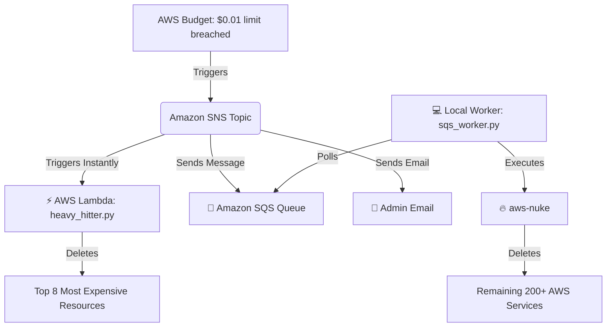

# Comprehensive Analysis: AWS Nuclear Button — Hybrid Kill Switch

## 1. What is this project?
The **AWS Nuclear Button** is a budget-triggered auto-termination system designed to protect your AWS account from surprise billing. When your AWS spending exceeds a predefined, very low threshold (e.g., **$0.01**), the system automatically and instantly terminates all expensive resources in your account. 

## 2. Why is it needed?
AWS has a "pay-as-you-go" model. While this is flexible, it's very easy to accidentally leave an expensive service running (like an EKS cluster, NAT Gateway, or large EC2 instance), or have your account compromised (crypto-mining), resulting in thousands of dollars in unexpected charges. AWS does not have a native "turn everything off if it costs money" button. This project builds exactly that: a fail-safe **"Kill Switch"** that guarantees you won't wake up to a massive bill.

## 3. How does it work? (The Architecture)
It uses a highly resilient, **two-layer architecture**:

1. **Layer 1 (The Immediate Responder):** An AWS Lambda function that fires *immediately* in the cloud. It doesn't rely on your laptop being turned on. It scans all regions and destroys the 8 most notoriously expensive AWS services.
2. **Layer 2 (The Deep Cleanup):** A Python script running on your local computer. It continuously checks a queue (SQS) for a budget alert. If it sees one, it runs `aws-nuke` to completely wipe your AWS account clean of the remaining 200+ obscure services that Lambda didn't catch.

---

## 4. AWS Services Used (The Setup)
To understand this project, you need to understand the AWS services that wire it together, even if they aren't explicitly coded in the repository.

### A. AWS Budgets (The Watchdog)
*   **What it is:** A billing service that monitors your AWS spending.
*   **How it's used:** You set a budget of $0.01. AWS Budgets checks your spending ~3 times a day. If your spending goes over $0.01, the Budget sounds the alarm.
*   **Why it's needed:** It is the trigger for the entire system.

### B. Amazon SNS (Simple Notification Service) (The Alarm Bell)
*   **What it is:** A pub/sub messaging service. You send one message to an SNS "Topic", and it broadcasts it to multiple "Subscribers" (like email, Lambda, or SQS).
*   **How it's used:** The AWS Budget triggers the SNS Topic. The SNS Topic then broadcasts the alert to three places simultaneously: the Lambda function, the SQS queue, and your email address.

### C. AWS Lambda (The Executioner)
*   **What it is:** Serverless computing. You give it code, and AWS runs it on demand without you managing servers.
*   **How it's used:** It runs the `heavy_hitter.py` script the millisecond the SNS topic alerts it.

### D. Amazon SQS (Simple Queue Service) (The Waiting Room)
*   **What it is:** A message queuing service. It holds messages temporarily until a worker processes them.
*   **How it's used:** SNS sends a message to SQS saying "Nuke the account". SQS holds this message. Your laptop (running `sqs_worker.py`) constantly asks SQS, "Do you have any messages?". If your laptop is offline, SQS holds the message until your laptop comes back online.

### E. AWS IAM (Identity and Access Management) (The Bouncer)
*   **What it is:** Manages permissions in AWS. 
*   **How it's used:** Lambda and your local worker need permission to delete things. IAM provides the Roles and Policies that say, "Yes, this script is allowed to delete EC2 instances and RDS databases."

---

## 5. Codebase Deep Dive

### `lambda/heavy_hitter.py` (The Cloud Layer)
This is the core of Phase 1. It is a Python script designed to run in AWS Lambda.
*   **What it does:** It uses the `boto3` library (the official AWS SDK for Python) to interact with AWS APIs. It scans every AWS region (prioritizing `ap-south-1` Mumbai) and looks for the 8 biggest money-drainers: EC2, RDS, NAT Gateways, EKS, Elastic IPs, SageMaker, Load Balancers, and unattached EBS volumes.
*   **How it works:**
    *   It defines a `lambda_handler` function, which is the entry point AWS Lambda calls.
    *   It loops through all enabled regions: `get_all_regions()`.
    *   For each region, it runs specialized functions like `terminate_ec2_instances(region)`.
    *   **Safety Features:** It includes a `DRY_RUN` variable for safe testing, and a `PROTECTED_TAGS` dictionary so you can tag certain resources (e.g., `Project=keep-alive`) to ensure the script *never* deletes them.
    *   It aggressively disables "Termination Protection" on EC2 and RDS instances right before deleting them.

### `local-worker/sqs_worker.py` (The Local Layer)
This runs on your personal computer in the background.
*   **What it does:** It runs a continuous loop (`while not shutdown.should_stop`), pinging Amazon SQS every few seconds.
*   **How it works:**
    *   It uses `boto3` to call `sqs_client.receive_message()`.
    *   It uses **long-polling** (`WaitTimeSeconds=20`). Instead of asking SQS 100 times a second (which costs money), it opens a connection and waits 20 seconds for SQS to reply. This keeps costs at $0.00.
    *   When it receives a message, it uses Python's `subprocess` module to trigger the `aws-nuke` CLI tool on your local machine.
    *   Once `aws-nuke` finishes, it deletes the message from SQS so it isn't processed twice.

### `local-worker/nuke-config.yaml` (The Nuke Configuration)
`aws-nuke` is a dangerous, open-source tool that deletes *everything* in an AWS account. This YAML file is its instruction manual.
*   **What it does:** It tells `aws-nuke` what regions to scan, what AWS account it is allowed to run against, and most importantly, what to **IGNORE**.
*   **How it works:**
    *   The `filters` section is critical. If `aws-nuke` deletes your IAM roles, SNS topics, or Lambda function, your Kill Switch will be broken forever.
    *   This file explicitly tells `aws-nuke` to skip any resource containing the words `"Kill-Switch"` or `"Nuclear-Button"`. It protects the infrastructure of the kill switch itself.

### `iam/lambda-permissions-policy.json`
*   **What it is:** A JSON document defining exact AWS permissions.
*   **How it works:** AWS uses a "default deny" model. The Lambda function cannot do anything unless explicitly allowed. This document lists the exact API calls (like `ec2:TerminateInstances`, `rds:DeleteDBInstance`) the Lambda function is legally allowed to execute.

### The PowerShell Scripts (`setup_windows_startup.ps1`, `remove_windows_startup.ps1`)
*   **What they do:** They configure Windows Task Scheduler so that your `sqs_worker.py` (or its compiled `.exe`) starts silently in the background every time you turn on your PC. This ensures the Layer 2 deep cleanup is always armed when your computer is running.

## 6. Summary of the Flow
1. **You make a mistake:** You leave a $70/month EKS cluster running.
2. **Detection (~8 hrs later):** AWS Budgets calculates your bill is $0.15. It crosses the $0.01 threshold.
3. **Alert:** Budget triggers SNS.
4. **Cloud Reaction (Seconds later):** SNS triggers Lambda. `heavy_hitter.py` runs, finds the EKS cluster, and deletes it. The financial bleeding stops immediately.
5. **Queueing:** SNS also sent a message to SQS.
6. **Local Reaction (Next time laptop is on):** `sqs_worker.py` wakes up, sees the message in SQS, and launches `aws-nuke`. `aws-nuke` scans your account for hours, deleting left-over security groups, empty VPCs, and weird obscure services that Lambda didn't know about.
7. **Clean:** Your account is at $0.00 recurring cost.
